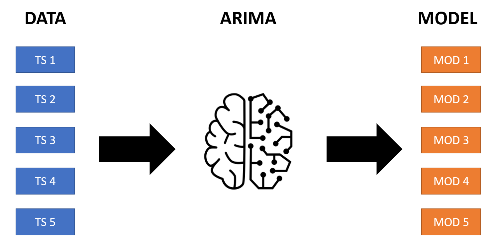

```{r setup, include=FALSE}
knitr::opts_chunk$set(echo = TRUE)
```



## Pendahuluan

Pada tutorial kali ini kita akan belajar cara untuk membuat model time series untuk masing-masing kategori data. Tutorial kali ini akan dibagi menjadi dua buah bagian, antara lain:

1.  multiple time series menggunakan nested arima
2.  multiple time series menggunakan sknifedatar

Tutorial ini akan berfokus pada bagian pertama dimana kita akan membuat sebuah model autoregressive integrated moving average (ARIMA) untuk masing-masing kategori data.

ARIMA merupakan sebuah model time series sequential yang memanfaatkan tiga buah proses utama, yaitu:

1.  membuat data menjadi stasioner melalui *differencing*
2.  pemodelan autoregressive
3.  pemodelan error menggunakan moving average

Agar model ini dapat diterapkan untuk masing-masing data time series, kita dapat menuliskan sebuah loop yang dapat memodelkan data time series untuk masing-masing kategorinya.

Kekurangan metode ini, antara lain:

1.  proses komputasi lama karena perlu membuat model sejumlah n kategori
2.  tidak dapat membuat model terbaik untuk masing-masing kategori

Untuk mengatasi masalah kedua, kita akan berkenalan dengan package `sknifedatar` yang akan dibahas pada tutorial selanjutnya.

Sebagai catatan sebelum masuk lebih jauh, pembaca dapat pula menggunakan model time series lainnya, seperti: prophet, pengalusan eksponensial, STL, dll. Untuk kemudahan kita hanya akan menggunakan model ARIMA saja.

## Pengenalan data

Data yang digunakan dalam tutorial kali ini adalah data time series jumlah pertanyaan berdasarkan jenis librarynya yang dicatat sejak tahun 2009 sampai dengan tahun 2019. Pembaca dapat menguduh datanya menggunakan tautan berikut: <https://www.kaggle.com/aishu200023/stackindex>.

## Packages yang digunakan

Terdapat beberapa packages yang digunakan dalam tutorial kali ini, antara lain:

1.  `tidyverse`: meta packages untuk workflow data science
2.  `tidymodels`: meta packages untuk workflow model prediktif
3.  `modeltime`: ekstensi `tidymodels` untuk model time series
4.  `timetk`: time series data wrangling

```{r warning=FALSE, message=FALSE}
library(tidyverse)
library(tidymodels)
library(modeltime)
library(timetk)
```

## Import data

Data yang digunakan memiliki ekstensi `csv`. Untuk dapat mengimport data dengan ekstensi tersebut, kita akan menggunakan fungsi `read_csv`.

```{r}
data <- read_csv("data/MLTollsStackOverflow.csv")
data
```

Untuk membuat ringkasan data dan mengecek struktur data, jalankan fungsi `glimpse`.

```{r}
glimpse(data)
```

Data yang digunakan memiliki 132 baris dan 82 kolom yang berarti terdapat data time series untuk 81 library yang dicatat.

Data yang kita miliki perlu melalui proses pembersihan untuk,

1.  memperbaiki jenis data kolom yang belum sesuai
2.  merubah format datanya menjadi tidy (mentransformasi tabel menjadi kolom date, library, dan value).

```{r}
stackoverflow_monthly_tbl <- data %>% 
  rename(date = month) %>% 
  mutate(date = lubridate::ym(date)) %>% 
  pivot_longer(-date, names_to = "library", values_to = "value")
```

Untuk mengecek apakah data yang dihasilkan sudah sesuai, jalankan perintah berikut:

```{r}
glimpse(stackoverflow_monthly_tbl)
```

## Visualisasi data

Pada tahapan ini, kita akan mencoba untuk memvisualisasikan 5 kelompok data time series.

```{r}
stackoverflow_monthly_tbl %>% 
  filter(library %in% c("r", "python", "nltk", "spacy",
                        "Gluon")) %>% 
  group_by(library) %>% 
  plot_time_series(
    .date_var = date,
    .value = value,
    .facet_ncol = 2,
    .interactive = FALSE,
    .smooth = FALSE
  )
```

## Pemodelan

Pada tahapan pemodelan terdapat beberapa tahapan yang akan dilakukan, antara lain:

1.  nesting data time series berdasarkan kolom library
2.  iterasi yang melibatkan pemodelan dan forecasting untuk 12 periode mendatang
3.  visualisasi hasil pemodelan

### Nesting

Proses nesting bertujuan untuk membuat chunk (kelompok data) yang selanjutnya akan diinputkan ke dalam proses iterasi. Untuk melakukan proses nesting, jalankan perintah berikut:

```{r}
data_nested <- stackoverflow_monthly_tbl %>% 
  nest(nested_column = -library)

data_nested
```

Kolom nested_column yang terbentuk menyimpan informasi terkait kolom date dan value untuk masing-masing library. Untuk mengembalikan data tersebut seperti semula, kita dapat menggunakan fungsi `unnest`.

```{r}
data_nested %>% 
  unnest(nested_column)
```

### Pembuatan model

Pembuatan model akan dilakukan dengan melakukan iterasi terhadap masing-masing baris pada kolom nested_column. Model ARIMA yang dibuat selama proses iterasi adalah model auto ARIMA. Model Auto ARIMA memungkinkan kita melakukan otomasi pencarian hyperparameter pada proses pemodelan ARIMA.

```{r message=FALSE, warning=FALSE}
model_table <- data_nested %>% 
  
  # iterasi pembentukan model untuk tiap baris data_nested
  mutate(fitted_model = map(nested_column,
                            .f = function(df){
          arima_reg() %>%
            set_engine("auto_arima") %>%
            fit(value ~ date, data = df) 
                            }
                              )
         ) %>% 
  
  # iterasi forecasting dengan input model
  # forecast horizon = 12 (12 bulan)
  mutate(nested_forecast = map2(fitted_model, nested_column,
                                .f = function(arima_model, df){

        modeltime_table(
            arima_model
        ) %>%
            modeltime_forecast(
                h = 12,
                actual_data = df)
                           }
                             )
        )

# cetak hasil pemodelan dan forecasting
model_table
```

Terdapat dua buah kolom baru yang dihasilkan dari proses iterasi, antara lain:

1.  `fitted_model`: model arima
2.  `nested_forecast`: forecasting berdasarkan model yang disimpan pada kolom `fitted_model`.

### Visualisasi hasil forecasting

Untuk menyederhanakan proses visualisasi, kita hanya akan memvisualisasi 5 kelompok data yang sudah di-forecasting.

```{r warning=FALSE, message=FALSE}
model_table %>%
    select(library, nested_forecast) %>%
    unnest(nested_forecast) %>%
    filter(library %in% c("r", "python", "nltk", "spacy",
                        "Gluon")) %>%
    group_by(library) %>%
    plot_modeltime_forecast(
      .facet_ncol = 2,
      .interactive = FALSE
      )
```

## Penutup

Kita telah belajar membuat model time series untuk kelompok data menggunakan ARIMA. Pembaca dapat mencoba memodifikasi script yang disediakan dan menggunakan model lain yang pembaca ketahui.

Perlu diingat bahwa model yang dihasilkan untuk masing-masing data bisa jadi tidak optimal karena kita hanya menggunakan sebuah model. Pemodelan perlu melibatkan beberapa model dan mencobanya untuk masing-masing kelompok data. Proses ini akan dipelajari lebih lanjut pada tutorial selanjutnya.

## Referensi

[Multiple ARIMA Model in R](https://youtu.be/3znQUrREUC8)
